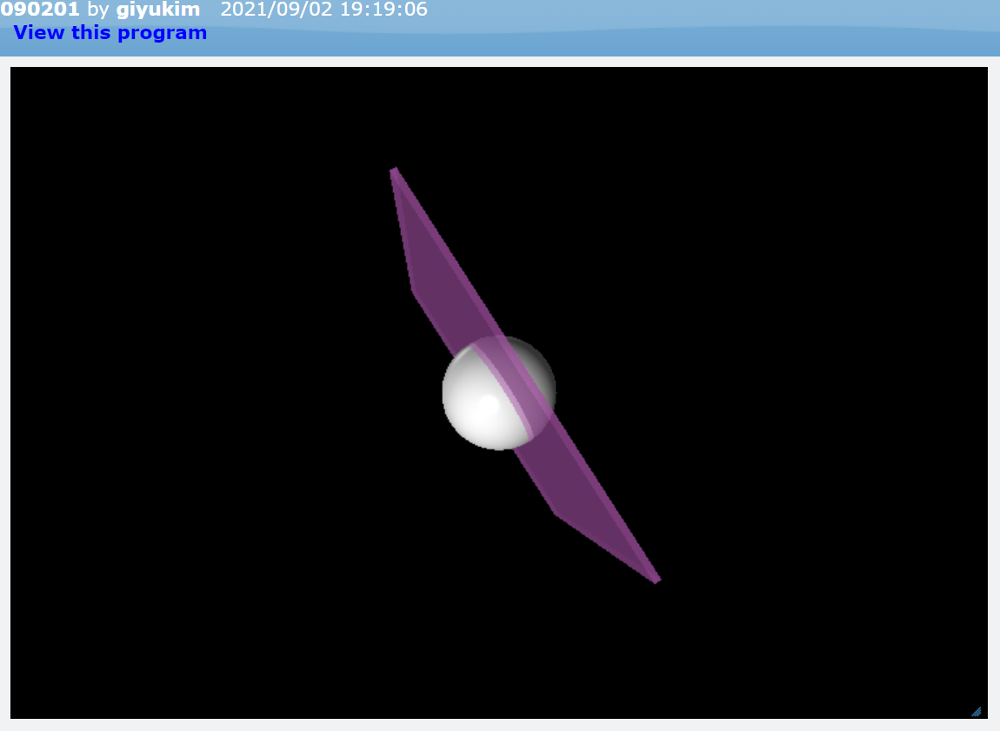

[◀ Back To Main][backtomain]

---
<br>

# VPython #1
#### 09/02/2021
---

<br>

VPython의 원과 박스의 기본적인 사용 방법에 대해 배웠습니다.  
<br>

프로젝트 링크: [GlowScript][ProjectLink]
```
sphere(pos = vector(0, 0, 0), radius = 2, color = color.white)  
box(pos = vector(0, 0, 0), size = vector(12, 12, 0.2), color = vector(1, 0.5 ,1), axis = vector(1, 2, 1), opacity = 0.5)
```


[ProjectLink]: https://glowscript.org/#/user/giyukim/folder/MyPrograms/program/090201 "Project Link"

[backtomain]: ../../README.md "Back To Main Page"