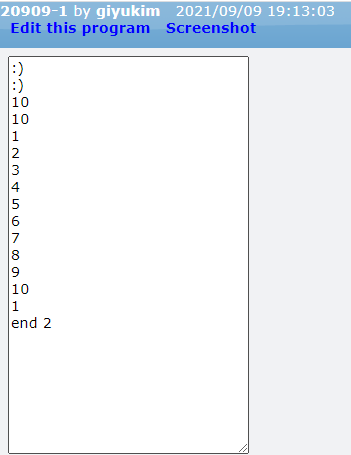
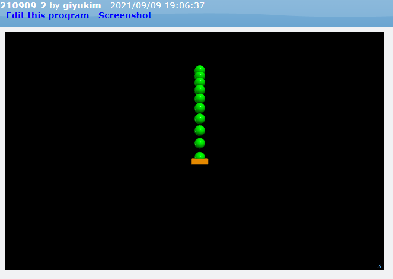

[◁ Back To Main][backtomain]

---
<br>

# VPython #2
#### 09/02/2021

---

<br>

## 01. Python
Python의 기본 문법 중 for, while, if 등을 배웠습니다.

<br>

프로젝트 링크: [GlowScript][ProjectLink0]
```
GlowScript 3.1 VPython

a = 10
b = 3

if a == 10 and b != 5 and b != 4:
    print(":)")

if a == 1 or b != 5:
    print(":)")

if a == 10:
    print(a)
    if b == 3:
        print(a)

for a in range(1, 11):
    print(a)

a = 1
while True:
    print(a)
    a += 1
    if a < 10:
        break
print("end", a)
```


---

<br>

## 02. VPython
VPython의 sphere과 box 함수와 파이썬 for, while, if 등의 기본 함수를 사용하여 도형을 움직였습니다.

<br>

프로젝트 링크: [GlowScript][ProjectLink1]
```
GlowScript 3.1 VPython

a = box(
    pos = vector(1, -2, 1),
    size = vector(3, 1, 3),
    color = color.orange,

)

b = sphere(
    pos = vector(1, 15, 1),
    radius = 1,
    color = color.green,

)

v = 1
a = 0.2

sleep(0.5)
while b.pos.y > 0:
    sphere(
        pos = vector(1, b.pos.y, 1),
        radius = 1,
        color = color.green,

    )
    v 
    b.pos.y -= v 
    v = v + a
    sleep(0.1)  
```


---

<br>

## 03. 느낀점
파이썬으 기본 문법과 VPython의 도형 들을 이용하여 여러 물리학적 실험 외에도 다른 여러 분야에도 활용될 수 있다는 것을 알았고, 어디에 활용될 수 있는지에 대해 더 생각해보고 싶었습니다.

[ProjectLink0]: https://glowscript.org/#/user/giyukim/folder/MyPrograms/program/210909-1 "Project Link"
[ProjectLink1]: https://glowscript.org/#/user/giyukim/folder/MyPrograms/program/210909-2 "Project Link"

[backtomain]: ../../README.md "Back To Main Page"