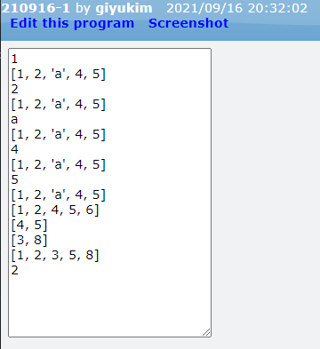
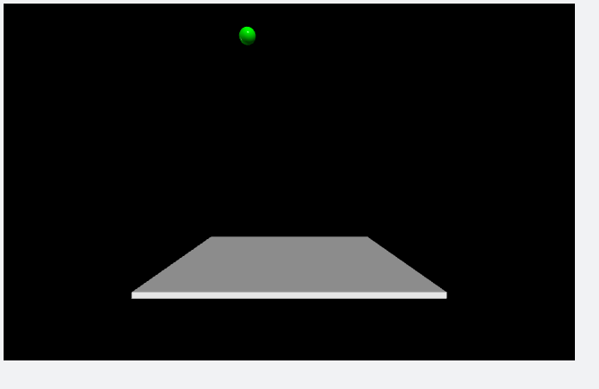
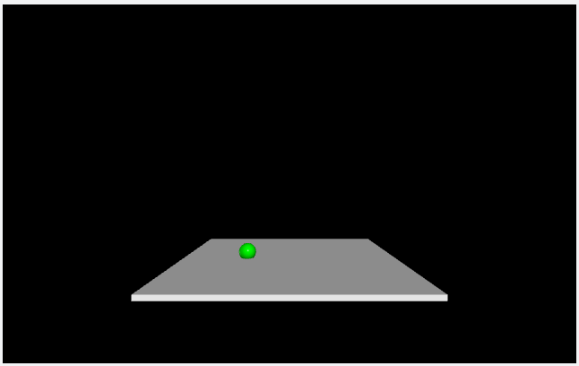

[◁ Back To Main][backtomain]

---
<br>

# VPython #3
#### 16/02/2021

---

<br>

## 01. Python
Python의 기본 문법 중 list와 이에 대한 활용에 대해 배웠습니다

<br>

프로젝트 링크: [GlowScript][ProjectLink0]
```
GlowScript 3.1 VPython

a = [1, 2, 'a', 4, 5]
for i in a: 
    print(i)
    print(a)
a.append(6)
a.remove('a')
print(a)
print(a[-3: -1])

a = [5, 2, 3, 8, 1]
print(a[2:4])
b = a
b.sort()
print(b)

a = [[1, 2, 3], [4, 5, 6]]
print(a[0][1])
```


---

<br>

## 02. VPython
VPython의 box와 sphere를 이용하여 구가 아래로 자유낙하 운동을 하여 박스에 닿으면 멈추는 코드를 작성하였습니다

<br>

프로젝트 링크: [GlowScript][ProjectLink1]
```
GlowScript 3.1 VPython

ball = sphere(
    pos = vector(-5, 18, 0),
    radius = 1,
    color = color.green
)
bottom = box(
    pos = vector(0, -9, 0),
    size = vector(25, 0.5, 25) # (width, height, depth)
)

v = vector(0, 0, 0) #init speed
y = ball.pos
g = vector(0, -9.81, 0) #gravity
dt = 0.005
t = 0.0

while True:
    rate(300)
    v += g * dt
    y += v * dt + 0.5 * g * dt ** 2

    if ball.pos.y < (bottom.pos.y + 1):
        break

    ball.pos = y
```



---

<br>

## 03. 느낀점
파이썬의 기본 문법과 VPython의 도형 들을 이용하여 여러 물리학적 실험 외에도 다른 여러 분야에도 활용될 수 있다는 것을 알았고, 어디에 활용될 수 있는지에 대해 더 생각해보고 싶었습니다.

[ProjectLink0]: https://glowscript.org/#/user/giyukim/folder/MyPrograms/program/210916-1 "Project Link"
[ProjectLink1]: https://glowscript.org/#/user/giyukim/folder/MyPrograms/program/210916-2 "Project Link"

[backtomain]: ../../README.md "Back To Main Page"