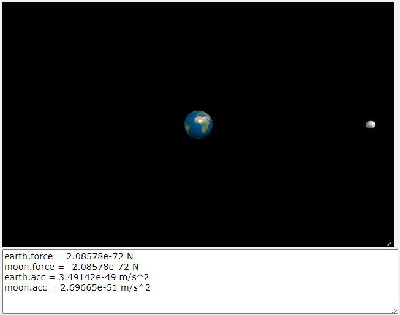
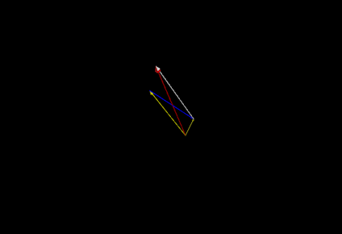
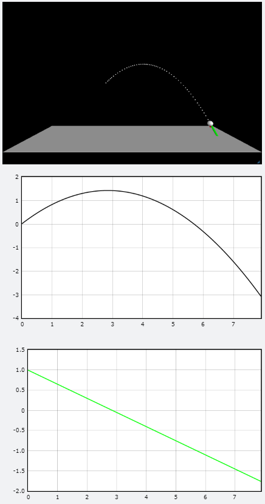

[◁ Back To Main][backtomain]

---
<br>

# VPython #4
#### 09/30/2021

---

<br>

## 01. VPython
VPython의 sphere를 이용하여 구의 등속 직선운동과 등가속도 직선 운동, 포물선 운동을 구현하였고, 구의 화살표로 arrow의 방향과 가속도의 방향을 표현하였습니다. 그리고 포물선 운동하는 구의 위치와 속도를 그래프로 나타내었습니다.
<br>

프로젝트 링크: [GlowScript][ProjectLink0]
```
GlowScript 3.1 VPython

scala_factor = 5.0
r = 384400000
G = 6.67e-11 # floating point, gravitational constant

earth = sphere(
    pos = vec(0, 0, 0),
    radius = 5.0 * 6371000,
    texture = textures.earth
)
moon = sphere(
    pos = vec(r, 0, 0),
    radius = 5.0 * 1737000,
    color = color.white
)

# mass
earth.mass = 5.974e-24
moon.mass = 7.7347e-22

# gravitation
F = G * earth.mass * moon.mass / (r ** 2)
# F = G * m * a^2

earth.force = F
moon.force = -F

# Newton's Third law
print("earth.force =", earth.force, "N")
print("moon.force =", moon.force, "N")

# acceleration f=ma
earth.acc = F / earth.mass
moon.acc = F / moon.mass

print("earth.acc =", earth.acc, "m/s^2")
print("moon.acc =", moon.acc, "m/s^2")
```


<br>

프로젝트 링크: [GlowScript][ProjectLink1]
```
GlowScript 3.1 VPython

# Calc Vector

a = vec(1, 2, 3)
b = vec(-4, 5, 6)
c = a + b
d = a - b
a_vec = arrow(
    pos = vec(0, 0, 0),
    axis = a,
    shaftwidth = 0.1
)
b_vec = arrow(
    pos = a,
    axis = b,
    shaftwidth = 0.1
)

#add
c_vec = arrow(
    pos = vec(0, 0, 0),
    axis = c,
    shaftwidth = 0.1,
    color = color.red
)

a_vec2 = arrow(
    pos = vec(0, 0, 0),
    axis = a,
    shaftwidth = 0.1,
    color = color.yellow
)
b_vec2 = arrow(
    pos = vec(0, 0, 0),
    axis = b,
    shaftwidth = 0.1,
    color = color.yellow
)

#min
d_vec = arrow(
    pos = b,
    axis = d,
    shaftwidth = 0.1,
    color = color.blue
)
```


<br>

프로젝트 링크: [GlowScript][ProjectLink2]
```
GlowScript 3.1 VPython

ball = sphere(radius = 0.2, pos = vec(-2, 0, 0))
ground = box(pos = vec(0, -4, 0), size = vec(15, -0.01, 5))

ball.v = vec(1, 1, 0)
ball.a = vec(0, -0.35, 0)

t = 0
dt = 0.01

attach_arrow(ball, 'v', shaftwidth = 0.1, color = color.green)
attach_arrow(ball, 'a', shaftwidth = 0.05, color = color.red)

attach_trail(ball, type = "points", pps = 5)

# Graph
motion_graph = graph(title = "position-time", xtitle = 't', ytitle = 'y')
g_ball_y = gcurve() # loc

motion_graph2 = graph(title = "velocity-time", xtitle = "t", ytitle = 'vy')
g_ball_vy = gcurve(color = color.green) # velocity

while ball.pos.y > ground.pos.y:
    rate(1 / dt)
    ball.v += (ball.a * dt)
    ball.pos += (ball.v * dt) # s=vt
    g_ball_y.plot(pos = (t, ball.pos.y))
    g_ball_vy.plot(pos = (t, ball.v.y))
    t += dt
```


<br>


---

<br>

## 02. 느낀점
VPython의 Sphere함수 하나만으로 여러 물리법칙을 구현할 수 있는 점을 알았고, 다른 물리법칙도 VPython을 이용하여 구현해 보고 싶다고 생각하였습니다.
<a style="font-size: 5px; color: red; ">제발 다른거 해주세요...</a>

[ProjectLink0]: https://glowscript.org/#/user/giyukim/folder/MyPrograms/program/210930-1 "Project Link"
[ProjectLink1]: https://glowscript.org/#/user/giyukim/folder/MyPrograms/program/210930-2 "Project Link"
[ProjectLink2]: https://glowscript.org/#/user/giyukim/folder/MyPrograms/program/210930-3 "Project Link"

[backtomain]: ../../README.md "Back To Main Page"